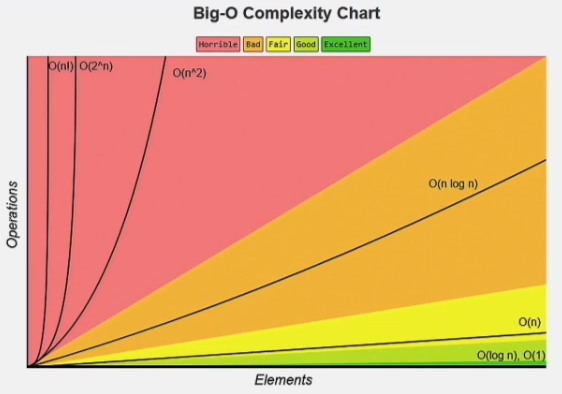

# Algoritms_LessonOD04
## Анализ сложности алгоритмов

✅Анализ сложности алгоритмов — это процесс оценки эффективности алгоритмов с точки зрения использования ресурсов, таких как время и память.

При оценке эффективности алгоритма нас чаще всего интересуют два параметра:

время выполнения алгоритма;
память, которую он использует.

Говоря проще, анализ сложности алгоритмов — это способ понять, как быстро и экономно алгоритм справляется со своей задачей, особенно когда входные данные становятся очень большими. Если данных мало, алгоритм справится быстро, но с увеличением объема данных возрастает и потребление ресурсов. Анализ сложности позволяет понять, насколько больше памяти и времени потребуется для работы алгоритма при увеличении объема данных.

Есть два типа характеристик, о которых мы сегодня поговорим:

Пространственная сложность. Она измеряет, сколько памяти (пространства) потребуется алгоритму для выполнения задачи в зависимости от размера входных данных.

Представим, что нам нужно записать результаты действий на бумаге. Пространственная сложность показывает, сколько бумаги понадобится для выполнения задачи с одной страницей, десятью страницами, ста страницами или тысячей страниц. Чем больше входных данных, тем больше потребуется памяти.

Временная сложность. Она измеряет, сколько времени потребуется алгоритму для выполнения задачи в зависимости от размера входных данных.

Представим, что нужно найти слово в книге. Временная сложность показывает, сколько времени потребуется на выполнение задачи, если у нас одна книга, десять книг, сто книг или тысяча книг. Чем больше книг, тем больше времени понадобится для поиска нужного слова.

Методы оценки сложности алгоритма

Если говорить о временной сложности, первое, что приходит на ум — это запуск алгоритма на компьютере и измерение времени его выполнения. Однако такой метод не подходит, так как на разных компьютерах алгоритм будет работать с разной скоростью из-за различий в мощности.

Поэтому сложность алгоритмов оценивают не по времени выполнения на определённом компьютере, а по количеству шагов, которые выполняет алгоритм.

Для оценки используются большие О-нотации (Big O).

✅Большие О-нотации — это способ описать, насколько быстро или медленно работает алгоритм, когда входные данные становятся очень большими. Это своего рода оценка, показывающая, как долго будет работать алгоритм или сколько памяти он будет использовать, если количество данных увеличится.

Главная идея этого метода в том, что от передаваемых параметров зависит количество операций, которые выполняет алгоритм перед тем, как завершить работу.

Эту зависимость можно увидеть на представленном графике. Здесь наглядно показано, как увеличивается количество времени от объема входных данных, которые поступают внутрь алгоритма.

На этом графике можно увидеть, что быстрее всех растёт время выполнения у n!, а стабильнее всех — у алгоритма со значением O(1), где скорость не меняется.

Приведём несколько примеров использования. Если у нас есть цикл for с фиксированным количеством повторений, например, 100, то количество шагов не зависит от входных данных. Если код всегда выполняется за одно и то же время и в нем одинаковое количество и он никак не зависит от размера входных данных, то здесь сложность будет считаться константной — O(1).

Если же мы заменим число 100 в цикле for на переменную n, которая вводится в программу, то количество шагов будет зависеть от входных данных. В этом случае сложность будет линейной — O(n). Если введём число 10, программа выполнит 10 шагов, если 100 — 100 шагов, и так далее. Таким образом, время выполнения алгоритма будет линейно расти с увеличением объема входных данных.

✅Константная сложность означает, что время выполнения алгоритма не зависит от размера входных данных.

В случае с константной сложностью неважно, насколько велик массив: алгоритм в любом случае выполняет одну и ту же операцию — в данном случае он возвращает элемент по указанному индексу. Доступ к элементу массива по индексу при этом осуществляется за постоянное время, так как массивы в памяти хранятся как непрерывные блоки.

✅Линейная сложность алгоритма означает, что время выполнения алгоритма пропорционально количеству входных данных.

Линейная сложность обусловлена тем, что алгоритм последовательно проверяет каждый элемент массива от начала до конца. В худшем случае, чтобы найти целевой элемент или убедиться в его отсутствии, потребуется проверить все элементы массива. Время выполнения здесь пропорционально увеличивается с количеством входных данных.

✅Логарифмическая сложность означает, что время выполнения алгоритма увеличивается логарифмически с увеличением размера входных данных.

Примером является бинарный поиск в отсортированном массиве.

Прежде чем писать алгоритм, объясним, что значит логарифмическая сложность, на примере из жизни. Представим, что у нас есть отсортированная коробка с однотипными предметами. Мы можем быстро найти нужный предмет, деля коробку пополам и проверяя, в какой половине находится искомое. Так с каждым шагом количество оставшихся вещей уменьшается в два раза. Таким образом, если в коробке 16 предметов, нам понадобится всего четыре шага, чтобы найти искомый предмет.

✅Логарифм — это количество шагов, которые требуется проделать для получения результата.

